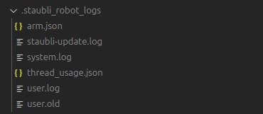

.. _demo_get_logs:

Show robot logs
================

Download robot logs
--------------------

You can retrieve the robot logs using the provided ROS2 script as follows:

.. code-block:: bash

    source install/setup.bash

    # Replace <robot_ip> with the actual IP address of your Staubli robot
    ros2 run staubli_robot_driver download_logs.py --ros-args -p robot_ip:=<robot_ip>

The logs will be downloaded to the current working directory in the folder ``.staubli_robot_logs``.

   You should get similar files to this when the logs are successfully downloaded.

Display robot logs in terminal
-------------------------------

Use the following command to display the robot logs in the terminal with color coding for better readability:

.. code-block:: bash

    source install/setup.bash
    ros2 run staubli_robot_driver show_logs.py

By default, this command will display the log messages since the last reboot (last ``RUN`` entry).
You should see output similar to this:

.. raw:: html

   <pre style="background-color: #2d2d2d; color: #f8f8f2; padding: 15px; border-radius: 5px; overflow-x: auto; font-family: 'Courier New', monospace; font-size: 14px;">
   Displaying USER log from .staubli_robot_logs/user.log since last reboot (new entries first):

   (Press 'q' to quit, or use arrow keys to navigate)

   Date Time Timestamp Type Severity Message

   03/11/2025 19:24:58 2892.120 msg ERROR ros2_server::controlTask : Error, hard stop and reset
   03/11/2025 19:24:58 2892.120 msg ERROR ros2_server::controlTask : Error, command sequence delay too high (5 ), going to STOP mode
   03/11/2025 19:24:58 2892.094 msg INFO ros2_server::controlTask : connection to controller established
   03/11/2025 19:24:58 2892.080 msg ERROR ros2_server::controlTask : Error, hard stop and reset
   03/11/2025 19:24:58 2892.078 msg INFO ros2_server::jointPositionControl : Stopping movejSync
   03/11/2025 19:24:58 2892.078 msg INFO ros2_server::controlTask : Stopping joint position command mode
   03/11/2025 19:24:58 2892.078 msg WARN ros2_server::controlTask : Error, transitioning from command modes requires a stop
   03/11/2025 19:24:58 2892.078 msg ERROR ros2_server::controlTask : Error, command sequence delay too high (5 ), going to STOP mode
   </pre>
