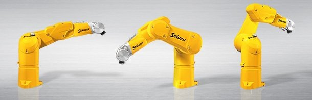

Staubli ROS2 Driver Stack
=============================

This package provides a ROS2 driver for Staubli robots, enabling integration and control within ROS2-based applications.

Current developments are based on the **jazzy** ROS 2 distribution (Ubuntu 24.04 LTS).
The driver is designed for Staubli robot with CS9 controllers, older versions are not supported.
To date, only position control is supported.
More control modes (velocity and hand-guiding) as well as diagnostics support will be included in subsequent releases.

.. note::
   This driver is currently in development. Due to interrupted funding, active development
   has been paused and is expected to resume shortly. The driver is shared in its
   current state following solicitations from the robotics community — please keep in mind
   that it is an early-stage prototype rather than industry-ready software.

   If your organisation relies on this software or would like to accelerate the
   implementation of specific features, project-specific funding or a research collaboration
   agreement can be arranged through the ICube Laboratory (University of Strasbourg). To do so, please contact
   `Laurent Barbé <laurent.barbe@unistra.fr>`_.

.. line-block::

   **Project GitHub repository:** https://github.com/ICube-Robotics/staubli_driver_ros2
   **Version:** |release|
   **Copyright:** © 2025 ICube Laboratory, University of Strasbourg, France.
   **License:** Apache License 2.0.
   **Author:** Thibault Poignonec <tpoignonec@unistra.fr> / <thibault.poignonec@gmail.com>

.. danger::
   🛑 **IMPORTANT - TEST SAFELY** 🛑

   In order to test the driver safely:

   * Always **test first in MANUAL mode**
   * Once you switch to **AUTO mode**, keep the **E-stop close by**
   * When testing the driver with MoveIt, start planning trajectories with a **(very) low velocity and acceleration scaling** (e.g., 10% max)
   * It is also recommended to **check the expected motion in RViz before executing it**

   ⚠️ **DISCLAIMER** ⚠️

   This software is provided "as is" **without any warranties**. The authors or distributors are **not liable for any damages**, including physical harm or financial loss, arising from the use or inability to use this software.

   **Users assume all responsibility and risk associated with its use.**

.. include:: toc.rst
