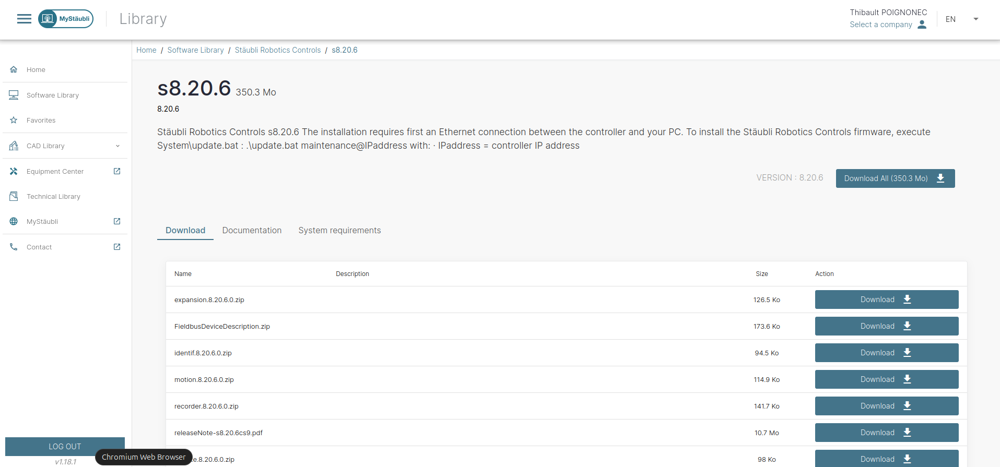
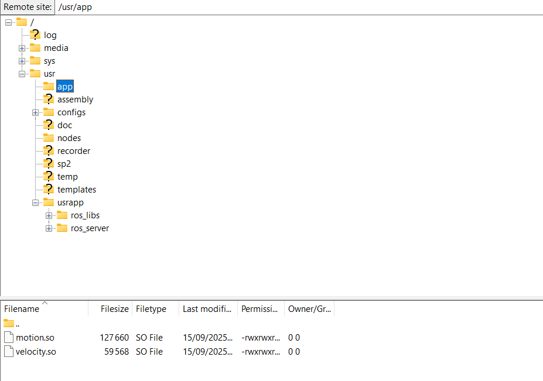

.. _installation_val3:

Installation VAL3 server
==========================

Prerequisites
**************

Staubli robot and **CS9** controller with firmware version **8.x.x** or higher.

Connect to the robot
*********************

1) Connect the ``J204`` Ethernet port to the remote controller PC (ROS2-side)
2) Setup your IP address as ``192.168.0.1`` with mask ``255.255.255.0``
3) Make sure you can communicate with the robot at ``192.168.0.254``:

.. code-block:: bash

    ping 192.168.0.254

Install required addons
************************

In order to use the ROS2 driver, you will need the following addons :

* motion
* velocity

.. note::
    The addons ``alter`` and ``advCtrlFunctions`` are also used, but they come shipped with the robot.
    However, if the ``alter`` or ``advCtrlFunctions`` license are in demo mode, the code will stop working after 2 hours.
    Although this should not be an issue for development and testing, you might want to get a full license from Staubli for long-term use.

To install an addon, download the compiled library from the `MyStaubli`_ portal website:

1. Log in to your Staubli account.

2. Navigate to the ``Software Download Center``.

3. Select your controller version in ``Stäubli Robotics Controls``

4. Download the desired addon.

    Example of addon download page on `MyStaubli`_ portal.

Then, copy the library (``<addon>.so``) to the ``/usr/app`` folder of the robot using FTP and **reboot the robot controller**.

.. hint:: By default, the ``usr/app`` folder does not exist. In that case, use ``FTP`` (e.g., FileZilla) to create the folder first.

    If you use FileZilla, it should look like this once the addons are transferred.

Install VAL3 application
*************************

You can upload the VAL3 app to the robot controller using the provided script:

.. code-block:: bash

    # Source Staubli driver ROS2 workspace
    source install/setup.bash

    # Upload VAL3 app to robot controller
    ros2 run staubli_robot_driver upload_val3_server.py

Alternatively, you can transfer the application manually using an FTP client (e.g., FileZilla).
To do so, copy the content of the ``staubli_robot_driver/val3/userapp`` folder to the ``/usrapp`` folder on the robot controller.

Setup the sockets
******************

From the robot pendant, create the necessary sockets:

1. Goto **E/S > Socket**
2. Select **Socket UDP** and press **(+)** to add the following sockets:

+-------------+-------------+---------+----------------+-------+-------------+
| Socket type | Socket name | Timeout | Fin de string  | Port  | IP remote   |
+=============+=============+=========+================+=======+=============+
| UDP         | control     | -1      | 10 (linux)     | 11000 | 192.168.0.1 |
+-------------+-------------+---------+----------------+-------+-------------+
| UDP         | diagnostics | -1      | 10 (linux)     | 11001 | 192.168.0.1 |
+-------------+-------------+---------+----------------+-------+-------------+

.. hint::
    If your PC, i.e., ROS2 driver-side, IP address is different than ``192.168.0.1``, change the ``IP remote`` field accordingly.

.. _mystaubli: https://www.staubli.com/global/en/robotics/services/MyStaubli-portal.html
