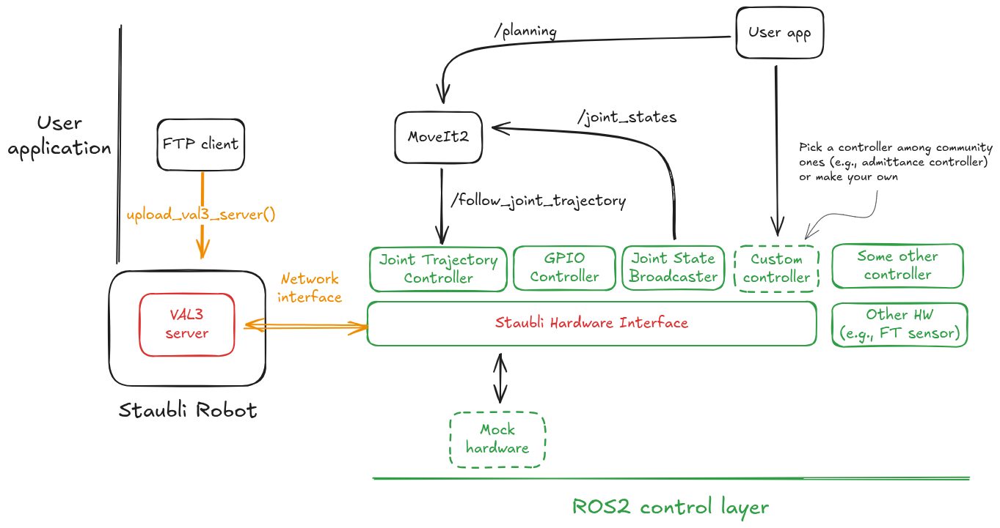

.. _overview:

Stack Overview
===============

The following ROS2 packages make up the Staubli Driver ROS2 stack:

- **staubli_driver_ros2**: Meta-package containing the documentation.
- **staubli_robot_driver**: The main package, containing the Hardware Interface and the VAL3 code that runs on the robot controller.
- **staubli_robot_description**: URDF and XACRO files for Staubli robots.
- **staubli_moveit_config**: MoveIt2 configuration package for Staubli robots.
- **staubli_bringup**: Launch files to start the driver and related nodes.

    The Staubli Driver ROS2 stack provides a VAL3 robot-side server and an ROS2 client in the form of a Hardware Interface.

Staubli Hardware Interface
---------------------------

State interfaces
^^^^^^^^^^^^^^^^

Joint state interfaces follow the form ``<robot_prefix><joint_name>/<interface_name>``.
The following joint state interfaces are provided:

- ``position``
- ``velocity``
- ``effort`` (estimated from current; not directly measured).

Supervision state interfaces use the form ``<robot_prefix>supervision/state``.
The following supervision states are provided:

- ``operation_mode``: integer code representing the current operation mode of the robot (manual, automatic, etc.).
- ``operation_mode_status``: integer code representing the current status. Meaning varies depending on ``operation_mode``; see the VAL3 documentation for details.
- ``safety_status``: integer code representing the current safety status (E-stop, SS1, SS2, etc.).
- ``control_sequence_delay``: the **total** delay in the control loop (ping-pong), expressed in number of cycles.
- ``brakes_released``: boolean indicating whether the robot brakes are released (i.e., power ON).
- ``motion_possible``: boolean indicating whether motion is currently possible (no E-stop, no safety violation, brakes released, etc.).
- ``in_motion``: boolean indicating whether the robot is currently moving.
- ``in_error``: boolean indicating whether the robot is in an error state.
- ``estop_pressed``: boolean indicating whether the emergency stop is currently pressed (see also ``safety_status``).
- ``wait_for_ack``: boolean indicating whether the robot is currently waiting for an acknowledgment from the operator (i.e., Safety Restart).

GPIO state interfaces use the form ``<robot_prefix>gpio/<gpio_name>``.
The following GPIO states are provided:

- ``digital_input_i``: where ``i`` is the input number (up to 16).
- ``analog_input_i``: where ``i`` is the input number (up to 4).

Control interfaces
^^^^^^^^^^^^^^^^^^

Joint control interfaces follow the form ``<robot_prefix><joint_name>/<interface_name>``.
The following joint control interfaces are provided:

- ``position``
- ``velocity`` (not implemented yet).

GPIO control interfaces use the form ``<robot_prefix>gpio/<gpio_name>``.
The following GPIO controls are provided:

- ``digital_output_i``: where ``i`` is the output number (up to 16).
- ``analog_output_i``: where ``i`` is the output number (up to 4).

Parameters
^^^^^^^^^^

The driver can be configured using parameters passed through the XACRO macro (see ``staubli_robot_description/r2c/staubli.r2c.xacro``).

The following parameters can be set for each robot instance:

- ``robot_ip`` (string): IP address of the robot controller.
- ``robot_prefix`` (string): Prefix to add to all link, joints, and interfaces of this robot.
- ``num_digital_inputs`` (int, default: 16): Number of digital inputs available on the robot.
- ``num_digital_outputs`` (int, default: 16): Number of digital outputs available on the robot.
- ``num_analog_inputs`` (int, default: 2): Number of analog inputs available on the robot.
- ``num_analog_outputs`` (int, default: 2): Number of analog outputs available on the robot.

Additionally, the following parameters can be set to configure the communication ports:

- ``control_port`` (int, default: 11000): Port number for the robot control interface (robot side).
- ``diagnostic_port`` (int, default: 11001): Port number for the robot diagnostic interface (robot side).
- ``local_control_port`` (int, default: 11000): Port number for the local control interface (ROS2-side).
- ``local_diagnostic_port`` (int, default: 11001): Port number for the local diagnostic interface (ROS2-side).

FTP utility scripts
--------------------

The package provides utility scripts to facilitate file transfers to and from the robot controller using FTP.
These scripts can be found in the ``staubli_driver_ros2/scripts`` directory.
Currently, the following scripts are available:

- ``upload_val3_server.py``: Uploads the VAL3 server program to the robot controller.
- ``remove_val3_server.py``: Removes the VAL3 server program from the robot controller.
- ``download_logs.py``: Downloads log files from the robot controller.
- ``show_logs.py``: Displays log files from the robot controller in the console.
